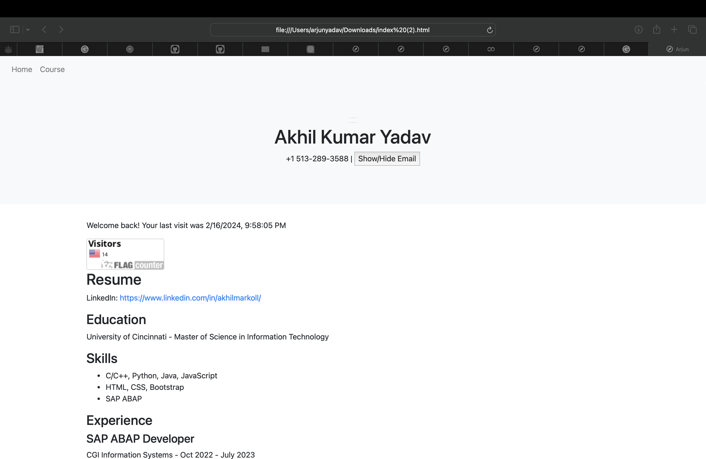
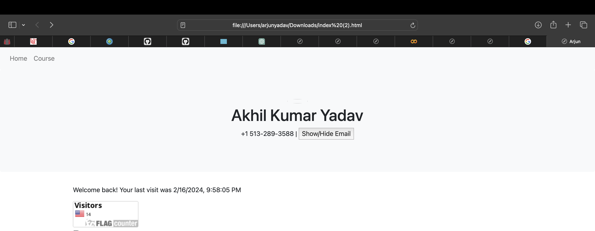
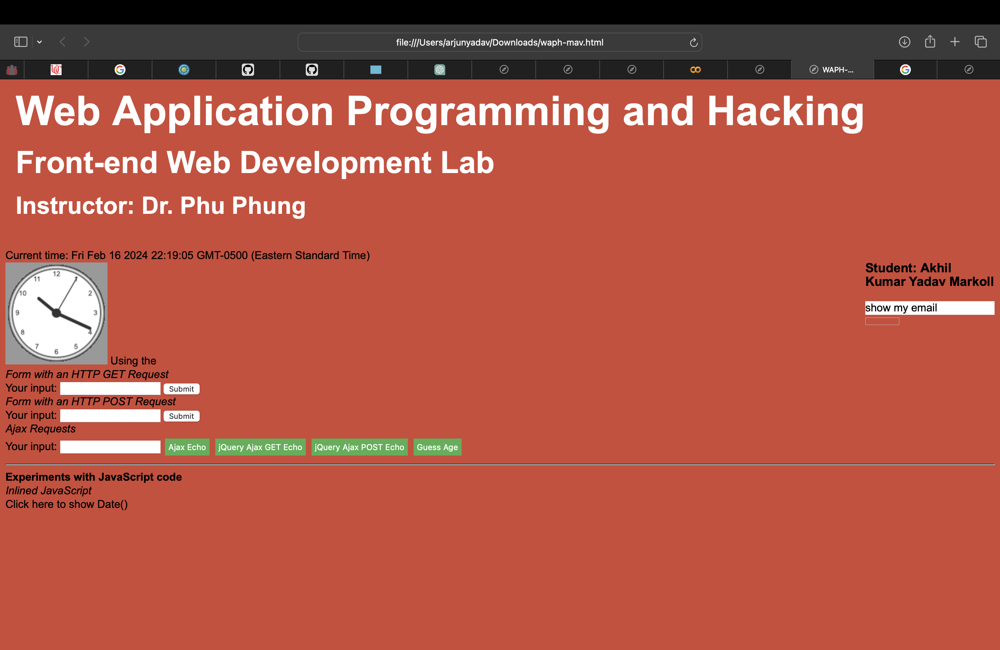
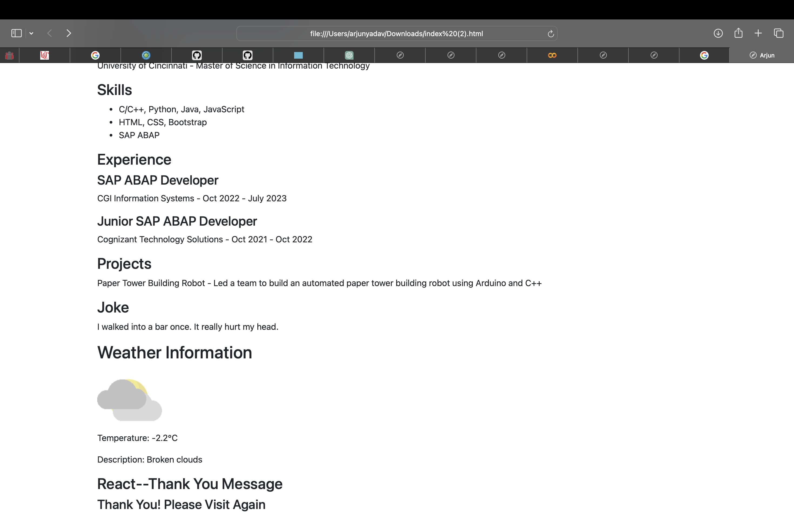
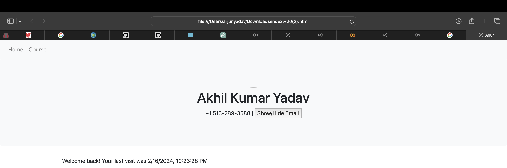

# WAPH-Web Application Programming and Hacking

## Instructor: Dr. Phu Phung

**Name**: Akhil Kumar Yadav Markoll

**Email**: mav@mail.uc.edu

**Short-bio**: I'm pursuing masters in Information Technology at University of Cincinnati. I'm is interested in software development and machine learning.  


## Repository Information

Respository's URL: [git@github.com:Akhil1524/mav.github.io.git](git@github.com:Akhil1524/mav.github.io.git)  

This is a private repository for Akhil to store all code from the course. The organization of this repository is as follows.

# Individual Project 1 – Front-end Web Development with a Professional Profile Website on github.io cloud service

## Overview and Requirements 

For my Individual Project 1, I created a professional profile website and hosted it on GitHub Pages. This website acts as a platform to display my resume, skills, and experiences, while also incorporating several technical features such as integrating a joke API, digital clock, analog clock, displaying my email ID, weather API, and Flag counter. The primary goals of this project were to improve my front-end web development skills and acquire hands-on experience in deploying websites using GitHub Pages.

The link to access my website is: [https://github.com/Akhil1524/mav.github.io.git/index.html](https://github.com/Akhil1524/mav.github.io.git/index.html)

The link to access Individual Project-1 is: [https://github.com/Akhil1524/mav.github.io](https://github.com/Akhil1524/mav.github.io)

## General Requirements

### Personal Website on Github.io

I established a new public repository named `mav.github.io` and utilized it to create a personal website hosted on GitHub Pages. The website showcases my resume, contact details, educational background, professional experiences, projects undertaken, certifications obtained, and skill sets.

The link to access my website is: [https://mav.github.io/index.html](https://mav.github.io/index.html).



### "Web Application Programming and Hacking" course and related hands-on projects on waph.html file

I developed a dedicated page named "waph.html" within my repository to introduce the "Web Application Programming and Hacking" course along with its associated hands-on projects. This page provides overviews of Lab0, Lab1, Lab2, Hackathon 1, and Individual Project 1.

The link to access waph.html is: [https://mav.github.io/waph.html](https://mav.github.io/waph.html).

The link to this page is accessible from the personal website, as depicted in the screenshot below:


## Non-technical requirements

### Bootstrap Template

I obtained a Bootstrap template from the website `https://bootstrapmade.com/`.

I customized the template to meet my specific requirements and tasks assigned by the professor.

### Page Tracker

I incorporated a Flag Counter as a page tracker to monitor website visits and engagement.

Out of the two available options, I selected `https://flagcounter.com/`. After obtaining a key from the website, I integrated it into my code. The Flag Counter is now visible on my website's homepage as seamlessly integrated.

Code for integrating Flag Counter:

```html
 <a href="https://info.flagcounter.com/H94D"></a>
```




## Technical requirements

### A digital clock; An analog clock; show/hide your email:

Similar to Lab 2, I developed both a digital clock and an analog clock using JavaScript to present the current time. Additionally, I included functionality to toggle the visibility of the email address based on user interaction.

Source Code for the digital clock:
```JS
<script type="text/javascript">
function displayTime(){
document.getElementById('digit-clock').innerHTML = "Current time: " + new Date();
```

Source Code for Analog clock:
```JS
<div id="digit-clock"></div>
<canvas id="analog-clock" width="150" height="150" style="background-color:#999"></canvas>
<script src="https://waph-uc.github.io/clock.js"></script>
<script> var canvas = document.getElementById("analog-clock");
var ctx = canvas.getContext("2d");
var radius = canvas.height / 2;
ctx.translate(radius,radius);
radius = radius * 0.90
setInterval(drawClock, 10);

function drawClock(){
drawFace(ctx, radius);
drawNumbers(ctx, radius);
drawTime(ctx,radius);
```

Source Code for show/hide your email:

```JS
function showhideEmail() {
      if (shown) {
        document.getElementById('email').innerHTML = "Click here to show my email";
        shown = false;
      }
      else {
        var myemail = "<a href='mailto:sheelada" + "@" + "mail.uc.edu'>sheelada" + "@" + "mail.uc.edu</a>";
        document.getElementById('email').innerHTML = myemail;
        shown = true;
```

Screenshot Showing Digital clock, Analog Clock, Show/hide your email:




### One more Functionality of my choice


I integrated three public APIs for this task. Firstly, to showcase random jokes every minute. Secondly, to display gratitude. Lastly, to exhibit the weather in Cincinnati, OH using the weatherbit website API service.
1. Incorporated the jokeAPI (https://v2.jokeapi.dev/joke/Any, akin to Lab 2.2.d.i) with jokes of the Any category, ensuring a fresh joke is presented on the page every minute.
i) Utilized the Joke API to deliver jokes every minute. Implemented within the function named 'fetchJoke()'. 

### Joke API

Integrated the jokeAPI to fetch a new joke every minute and display it on the website.

Source code for Joke API:

```JS
  // Fetch a new joke every 1 minute
    function fetchJoke() {
        fetch('https://v2.jokeapi.dev/joke/Any')
            .then(response => response.json())
            .then(data => {
                document.getElementById("joke").innerHTML = data.setup + " " + data.delivery;
            });
        setTimeout(fetchJoke, 60000);
    }
```
Source code for Joke API:
```JS
    // Fetch a comic from XKCD
    function fetchComic() {
        fetch('https://xkcd.com/info.0.json')
            .then(response => response.json())
            .then(data => {
                document.getElementById("comic").innerHTML = "";
            });
          }     

          $(document).ready(function () {
        var apiKey = '91e44a5b870a44f38e07b6df7a0ebbe4'; 
```

### Weather API

Integrated the Weatherbit API to fetch current weather information for Cincinnati and display it on the website.

```JS

 // Make a GET request to Weatherbit API for current weather data
        $.get("https://api.weatherbit.io/v2.0/current", {
            key: apiKey,
            city: 'Cincinnati' // Example city, you can change it to any city you want
        })
            .done(function (data) {
                // Check if the request was successful and data is available
                if (data && data.data && data.data.length > 0) {
                    var weatherData = data.data[0];
                    var temperature = weatherData.temp;
                    var description = weatherData.weather.description;
                    var iconCode = weatherData.weather.icon;

                    // Construct the URL for the weather icon
                    var iconUrl = "https://www.weatherbit.io/static/img/icons/" + iconCode + ".png";

                    // Display weather information on the webpage
                    $("#weather-icon").attr("src", iconUrl);
                    $("#weather-details").html("<p>Temperature: " + temperature + "°C</p>" +
                        "<p>Description: " + description + "</p>");
                } else {
                    $("#weather-info").html("<p>Unable to fetch weather data.</p>");
                }
            })
            .fail(function () {
                $("#weather-info").html("<p>Error occurred while fetching weather data.</p>");
            });
    });
```



### Javascript Cookies

Implemented JavaScript cookies to remember the client's visit and display personalized messages based on whether they are a first-time visitor or returning user. For first time visit it shows "Welcome to my homepage!", for returning user it displays "Welcome back! Your last visit was (last visit time and date)".

```JS
<script>

    // Check for cookies and display welcome message
    function setCookie(cname, cvalue, exdays) {
    const d = new Date();
    // Convert to EST by subtracting 5 hours (EST is UTC-5)
    d.setTime(d.getTime() + (exdays * 24 * 60 * 60 * 1000) - (-0.01*60 * 60 * 1000));
    let expires = "expires="+ d.toUTCString();
    document.cookie = cname + "=" + cvalue + ";" + expires + ";path=/";
}

function checkCookie() {
    let lastVisit = getCookie("lastVisit");
    if (lastVisit != "") {
        // Convert the UTC time in the cookie to EST for display
        let lastVisitDate = new Date(lastVisit);
        lastVisitDate.setTime(lastVisitDate.getTime() - (-0.01* 60 * 60 * 1000));
        document.getElementById("welcome-message").innerHTML = "Welcome back! Your last visit was " + lastVisitDate.toLocaleString("en-US", {timeZone: "America/New_York"});
    } else {
        document.getElementById("welcome-message").innerHTML = "Welcome to my homepage!";
    }
    let now = new Date();
    // Set the cookie with the current time in EST
    setCookie("lastVisit", now.toUTCString(), 365);
}

    function getCookie(cname) {
        let name = cname + "=";
        let decodedCookie = decodeURIComponent(document.cookie);
        let ca = decodedCookie.split(';');
        for(let i = 0; i < ca.length; i++) {
            let c = ca[i];
            while (c.charAt(0) == ' ') {
                c = c.substring(1);
            }
            if (c.indexOf(name) == 0) {
                return c.substring(name.length, c.length);
            }
        }
        return "";
    }

```



